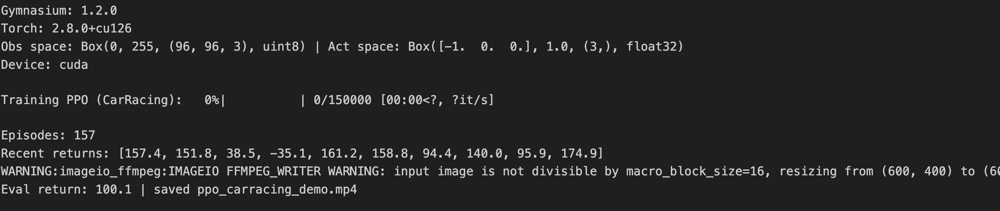

# Proximal Policy Optimization (PPO) — CarRacing-v3 (PyTorch from Scratch)

This repository contains a from-scratch implementation of the **Proximal Policy Optimization (PPO)** algorithm in PyTorch.  
The agent is trained on the **CarRacing-v3** environment from Gymnasium, demonstrating continuous control with stable policy gradient updates.

---

## Key Features
- Fully implemented from scratch in PyTorch  
- **Rollout Buffer** for storing and processing trajectories  
- **Clipped Surrogate Objective** to stabilize policy updates  
- **Entropy Regularization** to encourage exploration  
- Modular design for easy extension and testing  
- Demo MP4 video of trained agent included  

---

## Training Results
The agent successfully learns to drive in the CarRacing-v3 environment.  

📈 **Reward Curve:**  


🎥 **Demo Video:**  
[ppo_carracing_demo-2.mp4](./ppo_carracing_demo-2.mp4)

---

## File Structure
- `PPO_j.ipynb` — Jupyter/Colab notebook for training & quick tests  
- `Train-setup.py` — Core PPO training loop  
- `Rollout-Buffer.py` — Buffer for trajectory storage and returns calculation  
- `PPO-setup.py` — PPO agent (actor-critic, clipped updates)  
- `Eval-record.py` — Evaluation and MP4 recording  
- `env-setup.py` — Environment wrapper setup  
- `PPO-config.py` — Configurations and hyperparameters  
- `ppo_carracing_demo-2.mp4` — Demo video of trained agent  
- `reward-result.png` — Training reward curve  

---

## Quickstart
```bash
# Clone repository
git clone https://github.com/DHAANUS/PPO-CarRacing-from-scratch.git
cd PPO-CarRacing-from-scratch

# Install dependencies
pip install torch gymnasium[box2d] opencv-python imageio

# Train the agent
python Train-setup.py

# Evaluate and record demo
python Eval-record.py
